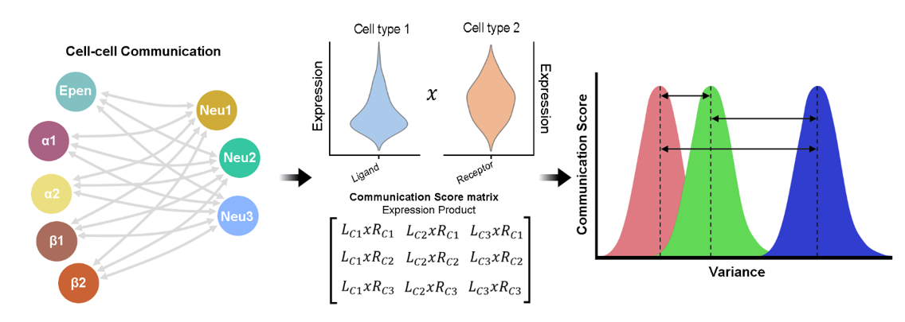
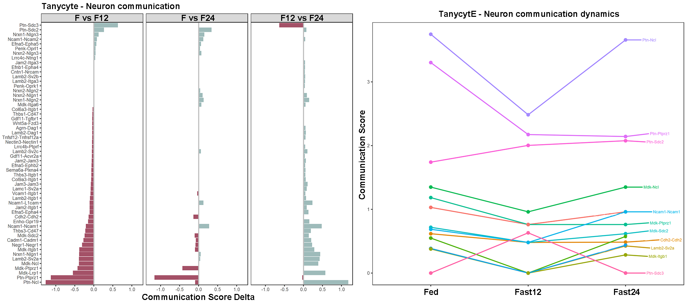

# ExPCom
This package provides a tool to infer cell-cell communnication using a scRNAseq dataset. The function calculate communication scores for a any set of ligand-receptor pairs (e.g. CellChat Database) based on expression product. The L*R expression product method allows to obtain a continuous value by multiplying all possible combinations of the expression of both interacting molecules between two given cell types.

<p align="center">
  
  <center>Illustrative picture of the original workflow used in https://www.biorxiv.org/content/10.1101/2023.07.06.547914v1</center>
</p>


## Installation 
ExPCom requires to have installed the package devtools, Seurat, stringr and reshape2. 
```
if (!requireNamespace("BiocManager", quietly = TRUE))
    install.packages("BiocManager")

BiocManager::install("devtools","Seurat", "stringr", "reshape2")
library(devtools)

devtools::install_github("dalodriguez/ExPCom")

library(ExPCom)
```

## Examples
<ul>
  <li><b>Calculating CCC in a dataset with a single condition</b></li>
</ul>


Combined scores can be calculated in a single condition using the ComScores() function. ComScores uses all idents of a seurat object by default but can be replaced by a subset of idents by providing them to the function. Please use the DB_CellChat.csv database file that can be uploaded from github or any other custom database. 

The database may be a dataframe containing three columns and as many rows as LR pairs, as in the following example: 


<table style="border:1px solid black;margin-left:auto;margin-right:auto;">
  <tr>
    <th>Ligand</th>
    <th>Receptor</th>
    <th>LR</th>
  </tr>
  <tr>
    <td>Kiss1</td>
    <td>Kiss1r</td>
    <td>Kiss1-Kiss1r</td>
  </tr>
    <tr>
    <td>...</td>
    <td>...</td>
    <td>...</td>
  </tr>
    <tr>
    <td>Lig</td>
    <td>Rec</td>
    <td>Lig-Rec</td>
  </tr>
</table>

The ComScores() function return a list cotainning as many dataframes as cell-cell comparisons (e.g. tanycyte-neurons). 
```
database = path_to_database

CCC <- ComScores(seurat_object,  idents= levels(seurat_object), database)

```
<ul>
  <li><b>Calculating CCC in a dataset with several conditions</b></li>
</ul>

By using an integrated seurat object containing two or more conditions, we can calculate communication scores for each condition and infer the dynamics of cell-cell communication using the DifComScores() function.

The DifComScores() function requires to define the name of the seurat_object meta.data column containing the conditions and cell types. As bellow, the database and the name of the idents to be included can be reduced if required. 

```
conditions = "condition"
cell_type = "cell_type"
database = path_to_database

CCC <- DifComScores(seurat_object, conditions= conditions, cell_type = cell_type)
```


## Visualization
The results the DifComScores() function can be used to evaluate the differences of communication between conditions by calculating the delta of communication scores obtained or by looking at the dynamics of cell-cell communication. 

<p align="center">
  
  <center>Example of the dynamics of cell-cell commuication</center>
</p>


## Suggestions and contributions 
Please use github issue tracker to report coding related issues or contact us directly, https://dalodriguez.github.io/Contact/

## How to cite?
M. Brunner, D. Lopez-Rodriguez, A. Messina, B. Thorens, F Santoni, F. Langlet. Pseudospatial transcriptional gradient analysis of hypothalamic ependymal cells: towards a new tanycyte classification. BioRxiv preprint. https://doi.org/10.1101/2023.07.06.547914

https://www.biorxiv.org/content/10.1101/2023.07.06.547914v1


<p align="center">
  <a href="#">
     
   </a>
</p>

